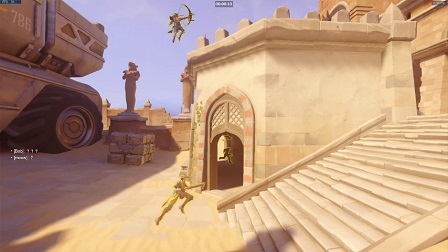
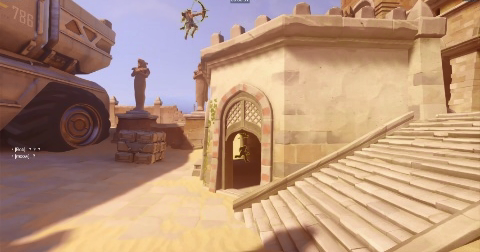
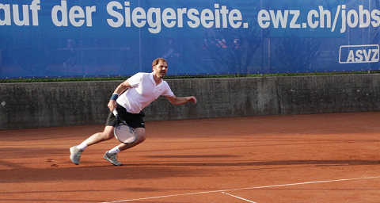
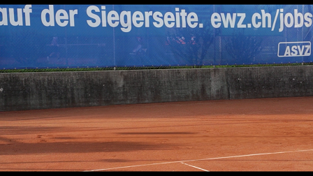
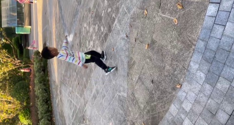
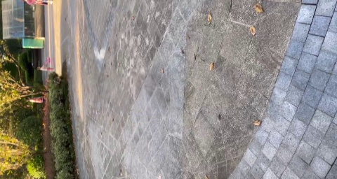

[](https://classroom.github.com/online_ide?assignment_repo_id=6406247&assignment_repo_type=AssignmentRepo)


# An object removal project based on STM mask & FGVC method


## Result exhibition

please check full video comparisons in the result folder<br>
We tested the method in different situations:

游戏 守望先锋 实机演示<br>
 <br>
<br>

体育 网球<br>
 <br>
<br>

生活 公园的侄子<br>
 <br>
<br>


## Contribution (equal)

- 贺伟男 PB18071481

    research&coding 

- 陈一恒 PB18030957

    research&coding 


## Problem description

Video inpainting is the problem of filling in missing regions in a video sequence with both spatial and temporal consistency. Video inpainting is beneficial for video editing, such as removing watermarks and unwanted objects. With the explosion of multimedia content in daily life, there are growing needs for inpainting sequences from multiple domains and real-world high-resolution videos. It is also expected to alleviate the human workload of labor-intensive mask labeling for semi-automatic object removal.


## Theory analysis

Our project is consisted of *Video Object Segmentation* and *Video Completion*. In the first part, we wish to find all the pixels representing the object in motion. In another part, modifying the color of these pixels to realize the removal effect is expected. 

Firstly, for object segmentation, in order to get the video mask, we apply an semi-supervised algorithm called space-time memory network(STM)which reached high score in the  DAVIS Challenge. It enables us just need to label the first frame for guidance or supervision, and then quickly get all the segmentation of the left frames. In a nutshell, it prepares the mask for the second part with fast speed.

Next, to fill the mask region with spatial and temporal consistency, the Flow-edge Guided Video Completion(FGVC) is implemented. It uses the optical flow which represents the projection from 3D to 2D as instruction to complete the missing edge and then, fill the region with the right color using information between frames. Also, it suggested an non-local algorithm to promote accuracy. When it was proposed, it reached the state of art on DAVIS data set.

Combining the methods above, we successfully realize the object removal effect. As long as the client input the video and point out the object(including humans) which he wishes to remove in the first frame, our method can output the video with accurate erasure effect. It processes quickly and need few human labels, which successfully satisfies our goals. On the other hand, there is still some room for improvement when we want to clear out the shadow of the object. Currently, some residual of shadows remians on certain samples. In summary, our method can solve the video completion problem with excellent feedback, while it still can be modified in the future.


## Code structure

```
|--code
|     |--eval_DAVIS.py
|     |--video_completion.py
|
|--input
|     |--source.mp4
|     |--first_frame_mask.png
|__output
      |--result.mp4
```


## Quick start

environment: 

- Python 3.6+ 
- pytorch, numpy, opencv, , imageio, imageio-ffmpeg, scikit-image, imutils, pillow, torchvision=0.7.0, cudatoolkit=10.1

At the beginnig, we divide the video into frames:

```
cd tool
python frame_cut.py
```

To run STM:

download the weight and place it in the same folder with STM:

```
wget -O STM_weights.pth "https://www.dropbox.com/s/mtfxdr93xc3q55i/STM_weights.pth?dl=1"
```

run on DAVIS-2016 validation set (Single-object) to get the mask frames:

```
python eval_DAVIS.py -g '1' -s val -y 16 -D [path/to/DAVIS]
```

Then, resize the video to satisfy the followed FGVC's need:

```
cd tool
python video_preproc.py
```

Finally, use FGVC for video completion:

```
cd tool
python video_completion.py \
       --mode object_removal \
       --path ../data/tennis \
       --path_mask ../data/tennis_mask \
       --outroot ../result/tennis_removal \
       --seamless
```

